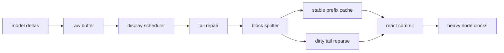
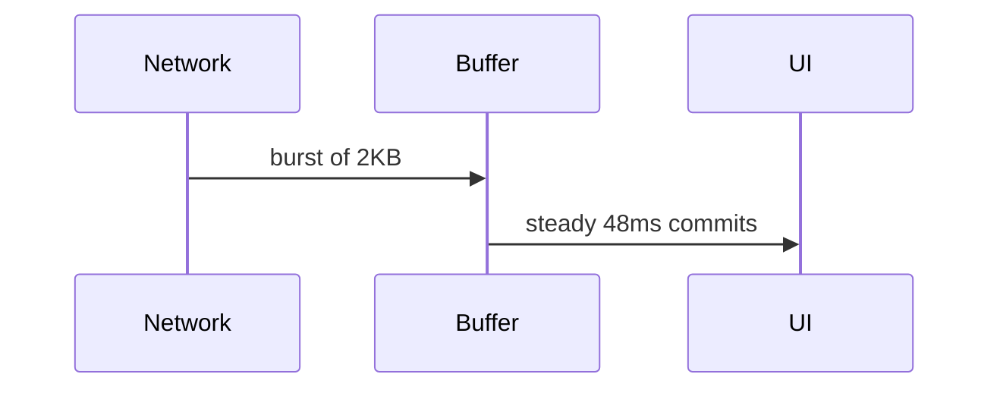

# Diagrams under streaming

Mermaid is the classic heavy node: the source arrives line by line, and almost every intermediate state is unparseable. The renderer should debounce, keep the last good SVG, and treat failures as "not yet".

While the diagram settles, prose keeps flowing normally. A table can sit right next to it:

| State | Renderer response |
| --- | --- |
| fence open, source partial | show source + loading hint |
| parse failed mid-stream | keep last successful SVG |
| fence closed, parse ok | render final diagram once |

And a second, smaller diagram to make sure two heavy nodes schedule independently:

The lesson: **heavy nodes need their own clock**, decoupled from text commits.
