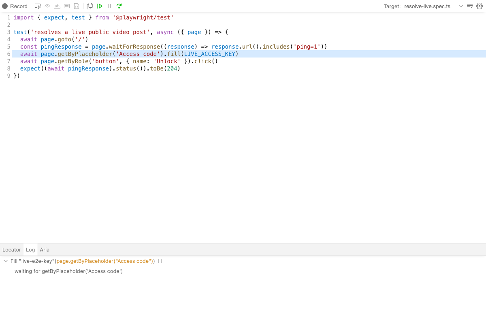
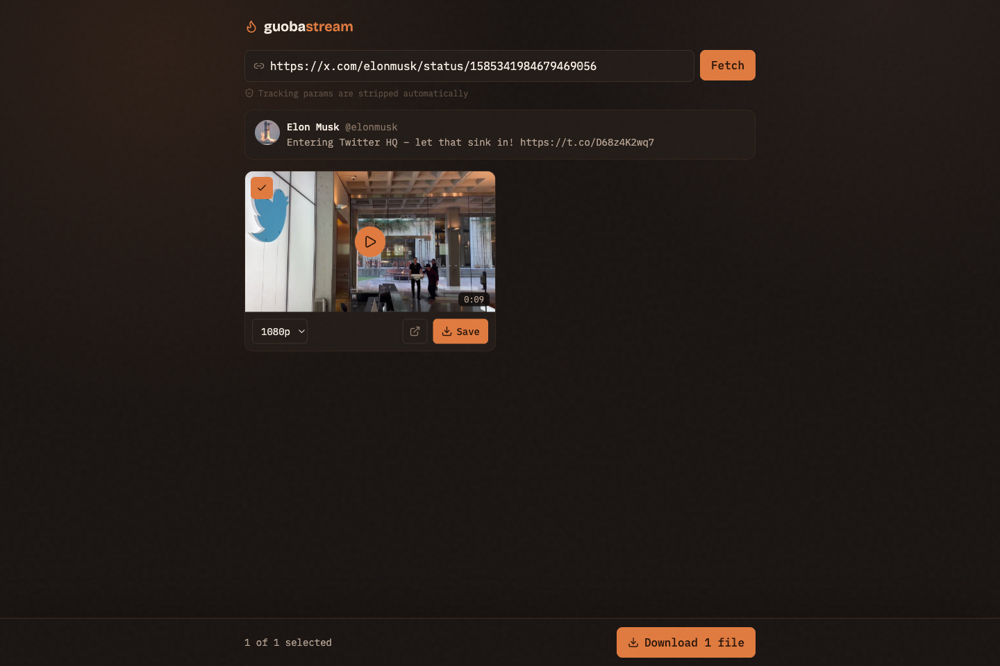
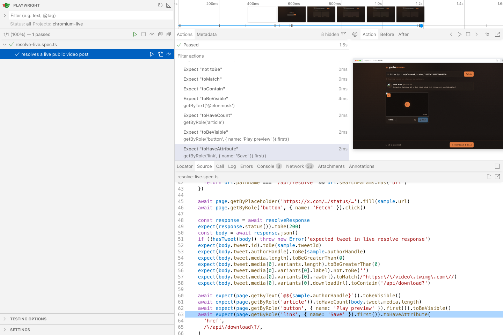

# guoba-stream

Private, invite-only downloader for X/Twitter videos and GIFs. Paste a post link,
pick quality, save — including batch download for multi-video posts. Mobile-first.

## How it works

- `api/resolve` — validates the `X-Access-Key` header, normalizes the link
  (x.com / twitter.com / mobile / `/i/status/` / t.co; query params are stripped
  structurally — the parser only ever reads the pathname), tries X's syndication
  API first and FxTwitter after restricted or recoverable upstream failures, then
  returns media with short-lived HMAC-signed download links (1h TTL).
- `api/download` — verifies the signature (no key needed; the signature is the
  authorization, because `<a>` navigation can't send headers), then streams the
  mp4 from `video.twimg.com` with `Content-Disposition: attachment`. A host
  allowlist plus filename sanitization prevent open-proxy abuse and header
  injection; range requests preserve the upstream `206` response and headers.
- Inline previews and raw-link fallbacks hit X's CDN directly — only actual
  downloads consume our bandwidth.

## Env vars (Vercel project settings; `.env.local` for dev, see `.env.example`)

| Var                       | Meaning                                                        |
| ------------------------- | -------------------------------------------------------------- |
| `ACCESS_KEYS`             | Comma-separated access codes; one per person, delete to revoke |
| `DOWNLOAD_SIGNING_SECRET` | HMAC secret for download links (32+ random chars)              |

## Commands

- `pnpm dev` — Vite + local `/api` bridge (`dev-api-plugin.ts`, dev-only)
- `pnpm test` / `pnpm test:e2e` — Vitest unit suite / Playwright (Desktop Chrome + iPhone 13)
- `pnpm test:e2e:live` — Chromium through the local `/api` bridge with real
  Syndication and FxTwitter requests; intended for manual or scheduled checks
- `pnpm lint` / `pnpm build`

## Watch the Live E2E

The default `pnpm test:e2e:live` command runs headless. The following modes show
the same Live E2E against real Syndication and FxTwitter responses, using only the
temporary access code and signing secret from `playwright.live.config.ts`.

Install Chromium once if it is not already available:

```bash
pnpm --filter guoba-stream exec playwright install chromium
```

### 1. Step through with Playwright Inspector

```bash
pnpm --filter guoba-stream exec playwright test \
  --config playwright.live.config.ts \
  --debug
```

This opens a headed browser plus Playwright Inspector. Use Resume (F8), Pause
(F8), and Step over (F10) to move through access-code entry, the real resolve
request, and the result assertions. The Inspector highlights the currently
paused source line and call log:



### 2. Watch the test run in a browser

```bash
pnpm --filter guoba-stream exec playwright test \
  --config playwright.live.config.ts \
  --headed
```

This runs both live scenarios at normal speed while keeping Chromium visible.
The resolved tweet, video card, quality selector, preview, and signed Save link
appear in the real application UI:



### 3. Explore and rerun with UI Mode

```bash
pnpm --filter guoba-stream exec playwright test \
  --config playwright.live.config.ts \
  --ui
```

UI Mode lets you run one scenario at a time and inspect its action timeline,
browser snapshots, source, console, and network requests:



These commands call external services and can fail because of X rate limits,
upstream outages, or deleted test posts. They do not use production credentials
and the automated scenarios do not download the complete video.

## Known limits

- Both syndication and FxTwitter are unofficial; if both fail, resolve returns the
  "upstream" error and this needs a new data source.
- NSFW / login-gated / deleted posts can't be fetched (clear error shown).
- Batch download fires N separate downloads; browsers may ask once for
  multi-download permission (iOS Safari confirms each file).
