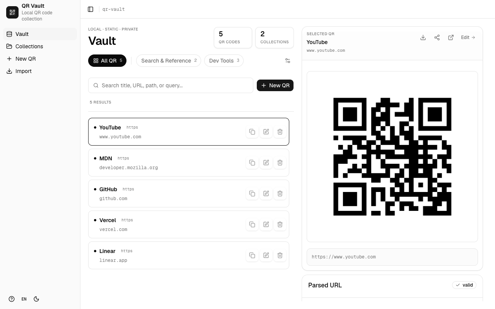
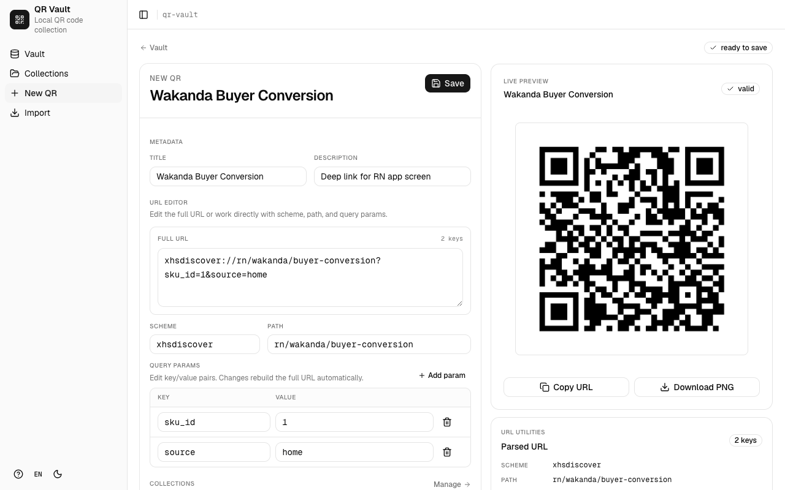
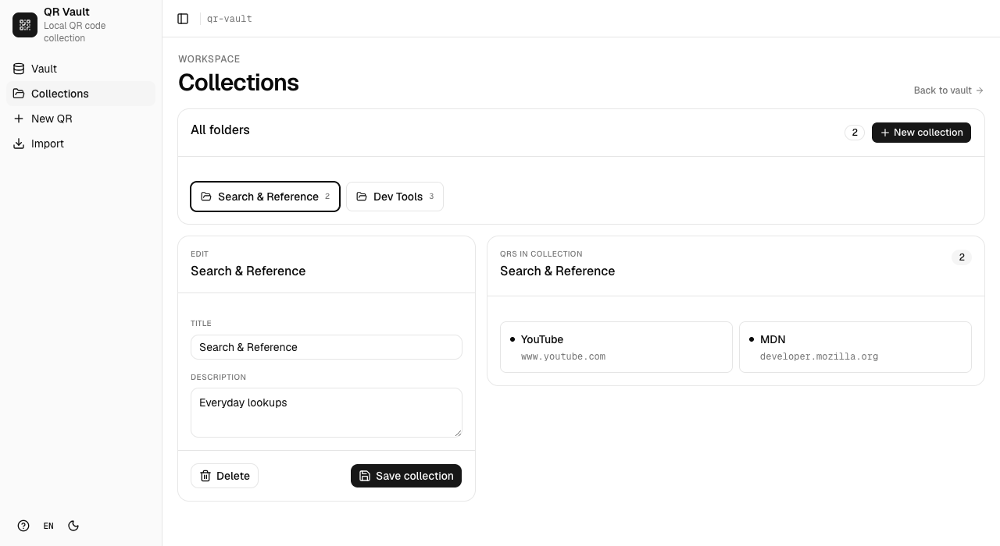
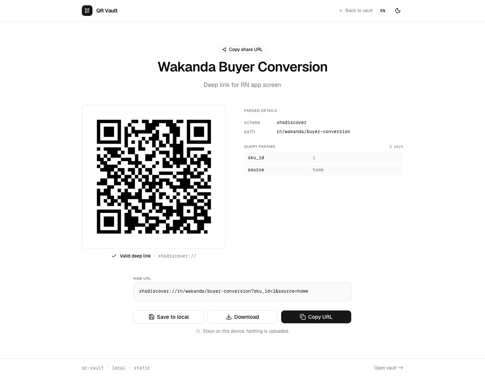
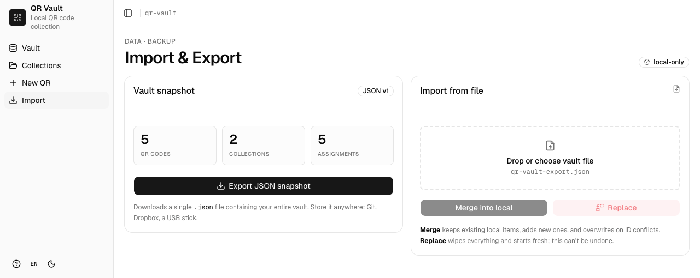

# QR Vault

> 📦 Your local-first vault for QR codes and deep links —— 零后端、零账号、零网络出站。

`Local-first` · `Static · Private` · `Deep-link aware`

线上 demo：<https://guoba-vibe-qr-vault.vercel.app/#/>



---

## 💡 Why QR Vault？

- **反复使用 / 测试同一批 deep link**：粘一次、起个名、归到 collection 里，之后随时一键复制 URL 或生成二维码——不用每次手输那段长长的 `xhsdiscover://...`。
- **拆得开的 deep link 编辑器**：scheme、path、query params 三种视图双向同步；改一个 query 值，右边二维码立刻刷新。专治 RN / Native 跳转链接的反复调参。
- **真·本地优先**：所有数据写进 `localStorage`，源码里没有任何 `fetch` / `axios` 调用，字体也走 bundle 不连 CDN。开完即用，关掉浏览器也不会泄漏到任何服务器。

## ✨ Features

### Vault：你的 deep link 主控台


- **双栏布局**：左侧列表，右侧 Inspector 显示选中条目的二维码、原始 URL、下载 PNG 与分享按钮。
- **Chip 行筛选**：顶部 `All QR` / `Uncategorized`（仅在有未归类条目时出现）/ 各 collection，附数量徽标。
- **多维搜索**：搜索框同时匹配 title、description、URL、scheme、path 以及任意 query 的 key / value。
- **删除有后悔药**：trash 按钮第一次点是"armed"，3 秒内再点一次才真删除；删除后 toast 内还有 `Undo` 一键恢复，并保留原 collection 归属。

### Deep link 编辑器



- **三种编辑视图双向同步**：完整 URL textarea、`scheme + path` 输入框、`query params` 行表格。改任意一个，其他两个跟着更新。
- **任意 scheme 都能解析**：不限 `http(s)`，`xhsdiscover://`、`myapp://` 等自定义协议都能正确拆成 scheme / path / params。
- **即时 QR 预览**：URL 校验通过才会渲染二维码；非法时显示虚线占位 + `Awaiting valid URL`，不会出"假 QR"。
- **`Save as New`**：在已有条目上改完，可以选择保存为新条目，避免覆盖原版本。

### Collections



- 三栏布局：左 = 所有 folder、中 = 新建 / 编辑 / 删除表单、右 = 当前 collection 下的 QR 列表。
- 多对多归属，QR 详情页用 multi-select picker 一次性管理。
- 路由 `/#/collections/<id>` 直接进入某个 collection 的子视图。

### Share —— 离开设备前再确认一次



- 分享链接形如 `https://…/#/share?url=…&title=…&description=…`，**所有参数走 URL hash**——浏览器不会把 hash 发到服务器，数据不会上云。
- 接收方落地页：QR 大图 + 解析详情（scheme / path / query params 一目了然）+ `Save to local`（一键写入对方自己的 vault）+ `Copy URL` / `Copy share URL`。
- 页面底部明确标注 _Stays on this device. Nothing is uploaded._

### Import / Export



- **导出**：一键下载 `qr-vault-export.json`，里面是完整 vault（QR + collections + 归属关系）。丢 Git / Dropbox / U 盘都行。
- **导入有两种语义**：
  - `Merge into local` —— 按 id upsert，重复 id 用 incoming 覆盖；不会丢已有数据。
  - `Replace` —— 全量覆盖本地，UI 上有红字明确警告 _can't be undone_。
- 校验严格：JSON 结构不合法时直接报错，本地数据不会被破坏。

### 上手即用

- **首次进入自动注入 demo 数据**：2 个 collection（Search & Reference / Dev Tools）+ 5 个常用站点（YouTube / MDN / GitHub / Vercel / Linear），不用对着空页面发呆。
- **Driver.js 四步引导**：New QR → URL 输入 → 实时预览 → Save。可在侧栏底部 `?` 按钮随时 replay。

### 其他贴心细节

- **Light / Dark 主题**：支持系统跟随，HTML 内联脚本在 React 挂载前就应用主题，避免首屏闪白。
- **中英双语**：内置 i18next，右下角一键切换 English / 简体中文，语言偏好记入 `localStorage`。
- **Toast 反馈**：使用 sonner，复制成功 / 删除 / 撤销都有顶部居中提示。
- **响应式**：主内容在 `lg` / `xl` 断点切多栏、移动端单列；侧栏在 768px 以下自动收成 Sheet。

## 🔒 Privacy & data

- 全部数据只写浏览器 `localStorage`，四个 key：
  - `qr-vault:data` —— vault 全量数据
  - `qr-vault:theme` —— 主题偏好
  - `qr-vault:locale` —— 语言偏好（en / zh-CN）
  - `qr-vault:onboarding-v1` —— 引导是否看过
- 另有少量临时 UI 状态走 `sessionStorage`（`qr-vault:last-saved-id`、`qr-vault:focus-title`），不含 vault 数据。
- **零网络出站**：源码里没有 `fetch` / `axios`，字体（Geist + Geist Mono）也打进 bundle，不连任何第三方 CDN。
- **备份建议**：清浏览器数据前，先去 `Import` 页面导出 JSON。换设备时把 JSON 拷过去再 `Merge` 或 `Replace`。
- **关于分享链接的安全提醒**：虽然数据不上传服务器，但 URL 本身明文写在 hash 里，截图 OCR 或 IM 历史都看得到。含 token / 个人信息的 deep link，别随手丢到公共群。

## ⚠️ Known limitations

- 删除条目的 `Undo` 仅在 toast 显示窗口内有效，错过就找不回。
- `Save as New` 会沿用当前 collection 归属，需要的话自行调整。

## 🛠️ Tech stack

- **UI**：React 19 + TypeScript 5
- **构建**：Vite 8（`base: './'`，产物可以放到任意子路径）
- **路由**：TanStack Router + `createHashHistory`——纯静态托管即可，无需后端 rewrite
- **i18n**：i18next + react-i18next，英文 / 简体中文全量双语
- **样式**：Tailwind CSS v4 + shadcn / Radix UI primitives + `tw-animate-css`
- **图标 & toast**：lucide-react + sonner
- **二维码**：`qrcode` 浏览器端 `toDataURL`
- **ID**：`nanoid` 自定义 8 位 URL-safe 字母表
- **引导**：driver.js
- **测试**：Vitest（jsdom + node 双 env）

## 🧑‍💻 Local development

需要 Node `>=24` 与 pnpm `11.3.0`（仓库根 `.nvmrc` / `packageManager` 已锁，建议用 corepack 启用）。

```bash
corepack enable
pnpm install
pnpm --filter qr-vault dev       # Vite dev server，默认 http://localhost:5173
```

常用命令（在仓库根目录用 `--filter` 跑；或 `cd apps/qr-vault` 后省略 `--filter qr-vault`）：

```bash
pnpm --filter qr-vault test      # 单测一次性
pnpm --filter qr-vault build     # tsc -b && vite build
pnpm --filter qr-vault preview   # 预览 dist 产物
pnpm --filter qr-vault lint      # oxlint
```

> 仓库根 `package.json` 没有 `dev` / `build` 脚本；统一用 `pnpm --filter qr-vault <script>` 定位到本应用。
